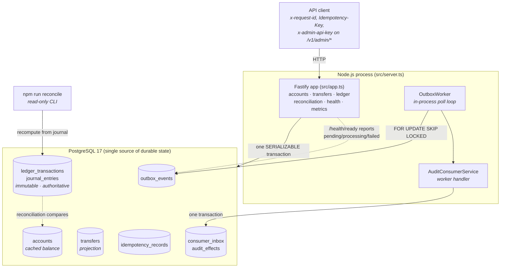
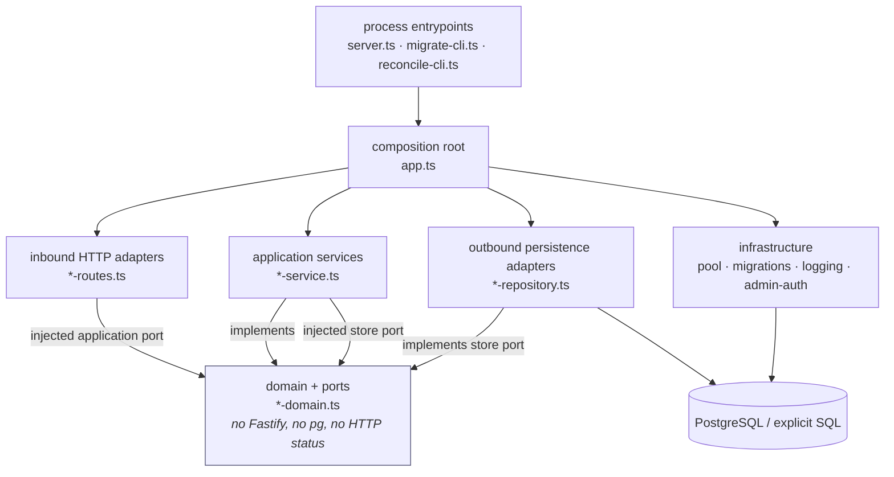
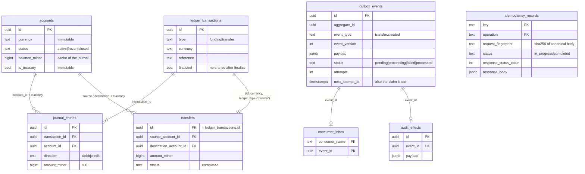

# Architecture diagrams

Rendered from the code as it exists at `v1.0.0`. If one of these diagrams disagrees with
`src/`, the code wins and the diagram is a bug — see [ARCHITECTURE.md](../ARCHITECTURE.md) for the
written contract these pictures summarize.

## 1. System context

One deployable Node.js process, one PostgreSQL database, no broker and no cache
([ADR-004](../adr/004-modular-monolith-database-worker.md)).

The immutable journal is the financial source of truth. `accounts.balance_minor` is a transactional
cache of it, and reconciliation exists to prove the two never drift.

## 2. Module dependency direction

`npm run architecture:check` (`scripts/check-architecture.ts`) fails the build when an arrow points
the wrong way. Dependencies point **inward**: adapters depend on domain contracts, never the reverse.

Rules the checker enforces:

| Rule                                                           | Why                                                         |
| -------------------------------------------------------------- | ----------------------------------------------------------- |
| `*-domain.ts` imports no framework, driver, or infrastructure  | Domain stays testable and transport-independent             |
| `*-routes.ts` imports no concrete service or repository        | Transport is swappable; the route sees only a port          |
| `*-service.ts` imports no route, repository, or infrastructure | Application logic never reaches for a connection itself     |
| `*-repository.ts` imports nothing inbound                      | Persistence stays a leaf                                    |
| `infrastructure/` and `ports/` import no feature module        | Shared code cannot depend on a feature it might outlive     |
| A feature may import only another feature's `*-domain.ts`      | Cross-feature coupling is a contract, not an implementation |

## 3. Durable data model

Enforcement that lives in PostgreSQL rather than TypeScript:

- **Composite currency foreign keys** — an entry, its transaction, and its account must agree on
  currency, so a mixed-currency posting cannot be inserted even by raw SQL.
- **Deferred constraint triggers** — at `COMMIT`, every transaction must be finalized and have
  `sum(debit) = sum(credit)`; an unbalanced posting aborts the whole transaction.
- **Append-only triggers** — `UPDATE`/`DELETE` on `ledger_transactions`, `journal_entries`,
  `consumer_inbox`, and `audit_effects` are rejected outright.
- **Balance check** — `balance_minor >= 0` for every non-treasury account.
- **Unique `(key, operation)`** — one idempotency key claims exactly one unit of work.
- **Primary key `(consumer_name, event_id)`** — one consumer applies an event at most once.
