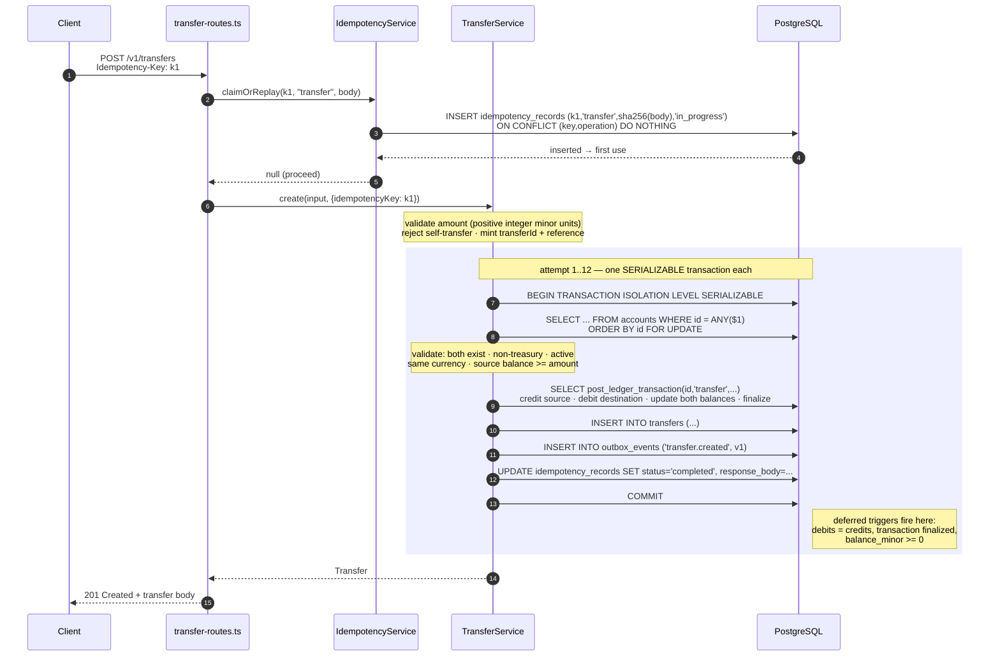
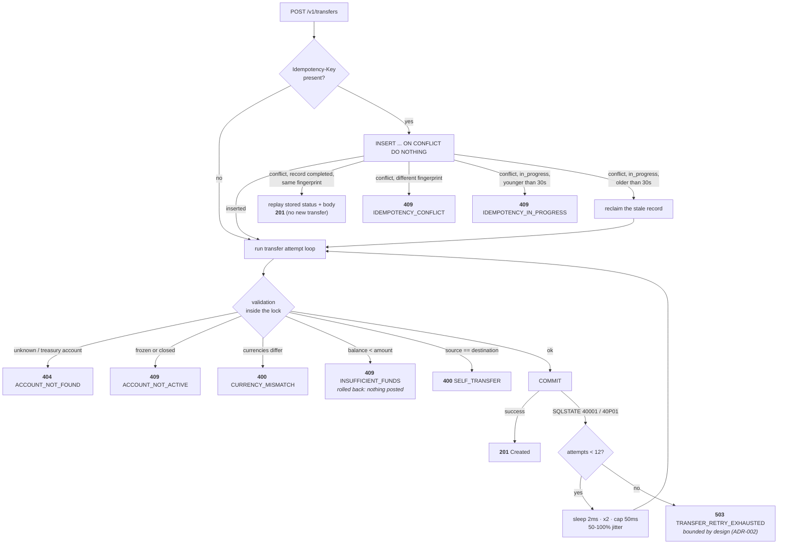
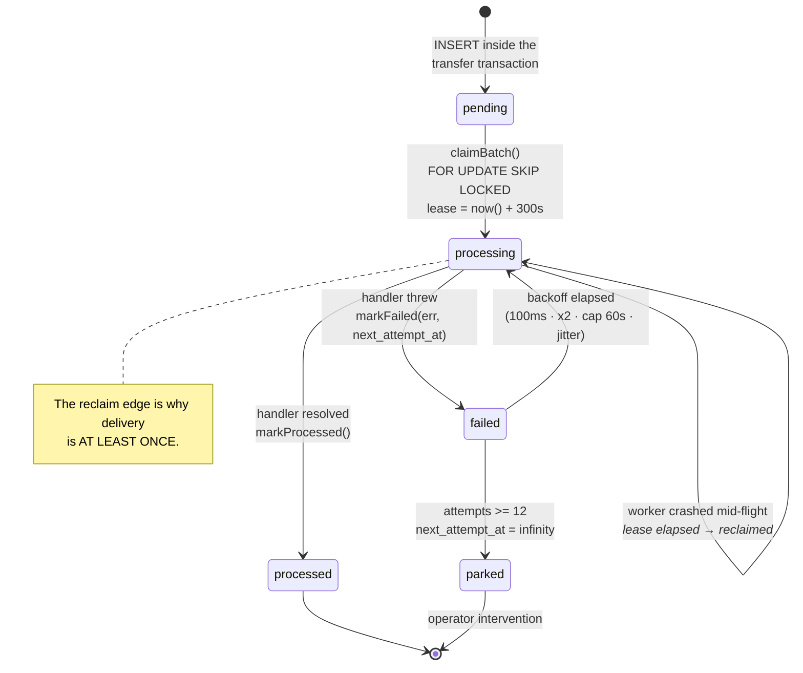
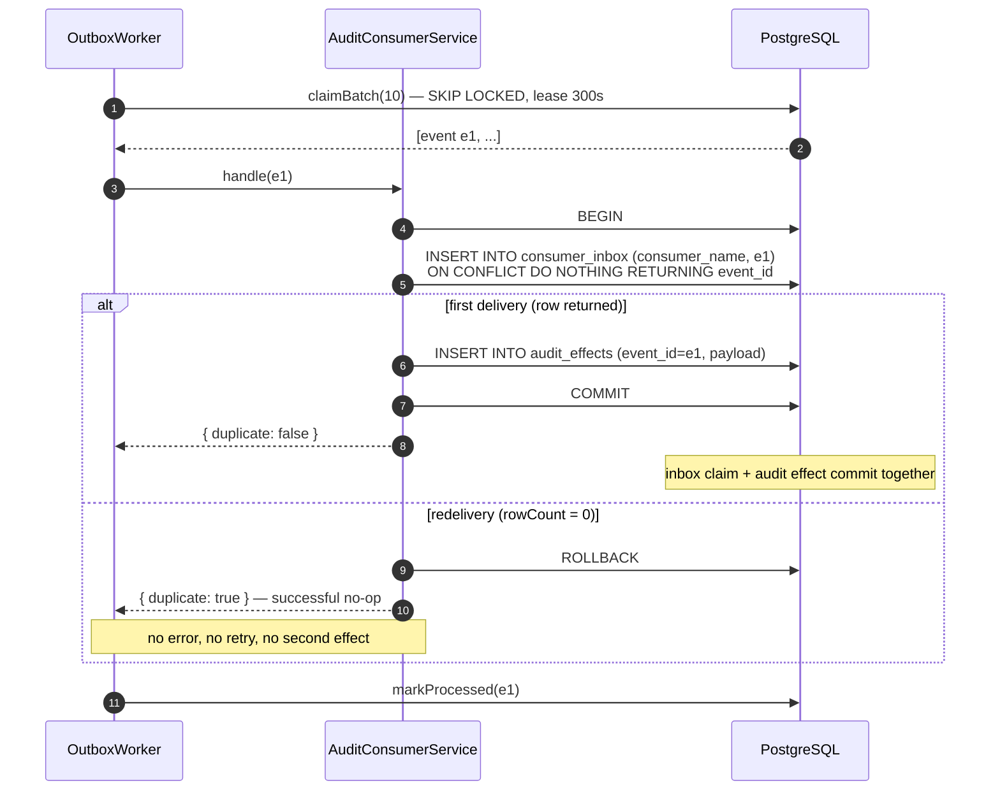
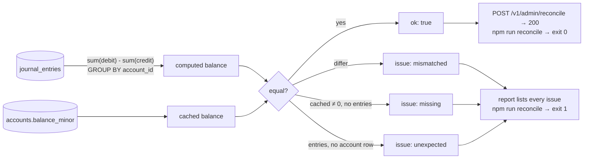

# Transaction-flow diagrams

How money actually moves, including every place the system can fail. Companion to
[architecture.md](./architecture.md); the narrative version lives in
[ARCHITECTURE.md § Runtime flows](../ARCHITECTURE.md#runtime-flows).

## 1. Idempotent transfer, happy path

The important line in this diagram is the transaction boundary: the journal entries, both cached
balances, the transfer projection, the outbox event, and the completed idempotency response are
**one commit**. Nothing outside PostgreSQL happens during the request.

Direction convention (ADR-001, asset accounts): a **debit increases** a balance and a **credit
decreases** it. A transfer therefore credits the source and debits the destination by the same
positive amount.

## 2. Every branch the same endpoint can take

Only `40001` (serialization failure) and `40P01` (deadlock) are retried. Business errors are
returned immediately — retrying "insufficient funds" would just burn the budget. The same
`transferId` and `reference` are reused across attempts, so a retry can never double-post.

## 3. Outbox event lifecycle

The worker's claim query and its crash-recovery mechanism are the same query: claiming pushes
`next_attempt_at` into the future, which doubles as a lease.

`/health/ready` exposes `pending` / `processing` / `failed` counts so a stuck backlog is visible
without a database session.

## 4. At-least-once delivery, at-most-once effect

The worker never tries to avoid redelivery. The consumer makes redelivery harmless — the
unique-constraint claim is the dedup boundary, and it commits in the same transaction as the effect
it guards.

Proven at scale by `tests/integration/audit-consumer.integration.test.ts`: **1,000 duplicate
deliveries of one event produce exactly one `audit_effects` row**, and two concurrent consumers
racing the same event still produce one.

## 5. Reconciliation

Independent of every write path above: it re-derives balances from the immutable journal and
compares. It is deliberately read-only — it reports drift and never repairs it, so a human decides
whether to post a reversing entry (ADR-001, ADR-004).

